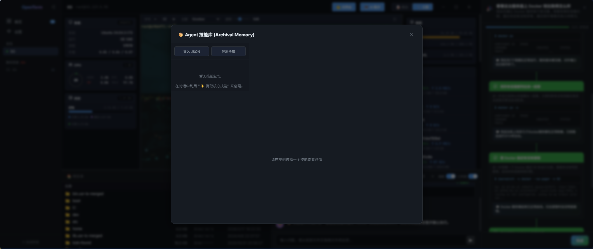
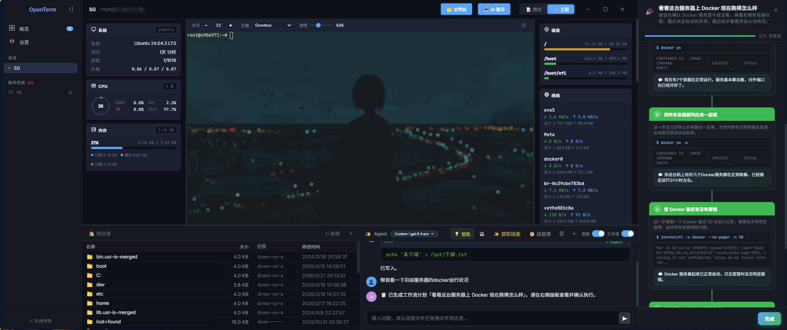
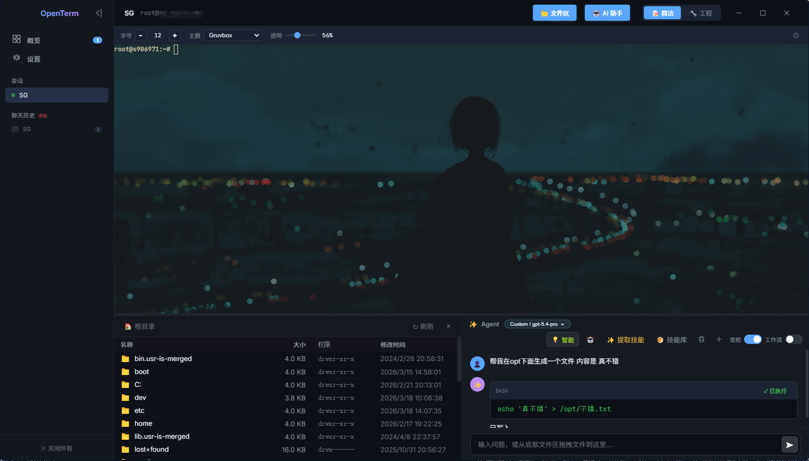
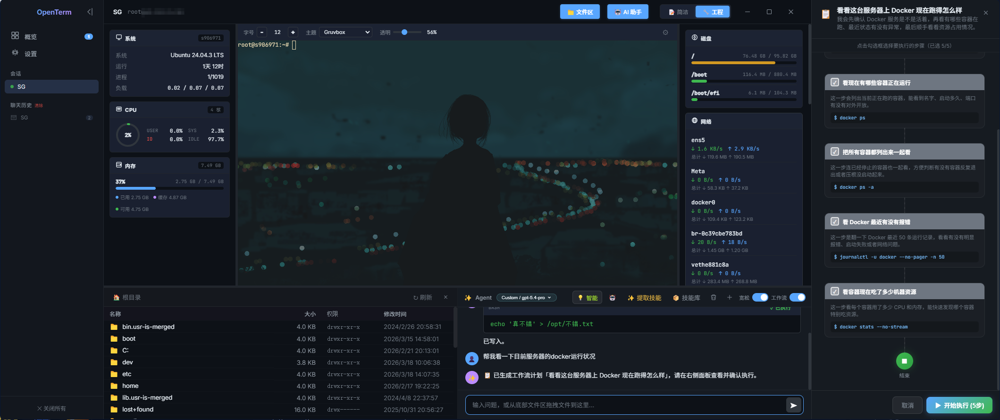

  
  <h1>OpenTerm</h1>
  
<b>你的终端，自带大脑。</b>

  

## 什么是 OpenTerm

OpenTerm 颠覆了传统的 SSH 连接工具——告别黑白命令行，迎接真正懂你的 AI 助理。它将大语言模型（LLM）与底层操作引擎深度结合，让你不仅能像往常一样敲击命令，更能一键呼叫内置的“Agent”为你排障、分析日志甚至直接修改代码。

向聊天框拖拽一份报错日志，AI 立刻诊断出断连根源；下发一句自然语言，它能协助接管终端为你部署环境。真正的“基于自然语言的 Linux 服务器运维”。

---

## 功能特性

### 🤖 原生化 AI 助手
*   **内置智能 Agent** —— 拥有内置的 Agent 系统。Agent 表现出极其专业、高效的 Linux 行事风格。
*   **统一 Composer 输入框** —— 一键呼出侧边栏对话框，向聚集在当前服务器环境上的 Agent 发送自然语言指令，它随时待命。
*   **宽松模式 (Relaxed Mode)** —— 授权后，在输入框发出需求，Agent 会自动生成并执行 `bash` 操作与文件修改脚本，你甚至能在屏幕上实时看到终端正在一层层自动敲击命令执行完毕。
*   **拖拽文件注入上下文** —— 可直接将服务器文件树中的单文件甚至是整个目录拖拽进 AI 对话框，自动提取内容结构作为上下文，无需再手动复制日志内容。

### 📊 智能分析与工作流面板
*   **智能诊断结果 (Agent Result Panel)** —— 执行完大段系统查询命令后，右侧面板会自动将难懂的源日志总结渲染成精美的「人类可读」的诊断摘要卡片。
*   **长代码折叠** —— 遇到超多行的繁杂脚本命令，前端将自动采用气泡折叠保护视图整洁，只需一键即可查看具体修改操作或查看原生系统日志输出。

### 📂 系统与服务器管理
*   **可视化文件管理 (SFTP)** —— 在侧边栏为你准备了直观的可视化文件树，支持双击预览、管理及文件编辑。
*   **多会话矩阵并行** —— Shell 终端、报错诊断、文件管理区域共存于同一极简画台中，不同主机连接并行不悖。

### ⚙️ 设置与高度定制化
*   **多 AI 模型接入支持** —— 本机内置设置项，兼容 OpenAI 标准 API 格式、DeepSeek、GPT-4、Claude 等市面上绝大多数第三方推理模型服务。
*   **深色模式 UI** —— 采用了现代化的深色模式布局，应用高斯模糊悬浮设计，带来极佳的终端代码审查体验。
*   **完全本地数据存储** —— 本体绝对纯净：不含任何强制云端数据收集。所有的主机会话、密码凭证与历史都会由底层的 `electron-store` 封装保存在本地 `AppData` 漫游区。

---

  
  

  

---

开源地址：[GitHub - XingZiH/Openterm](https://github.com/XingZiH/Openterm)  
**无任何内购付费，本体完全开源，MIT 协议** 
