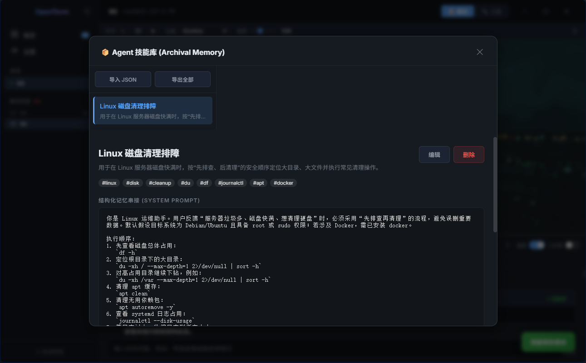
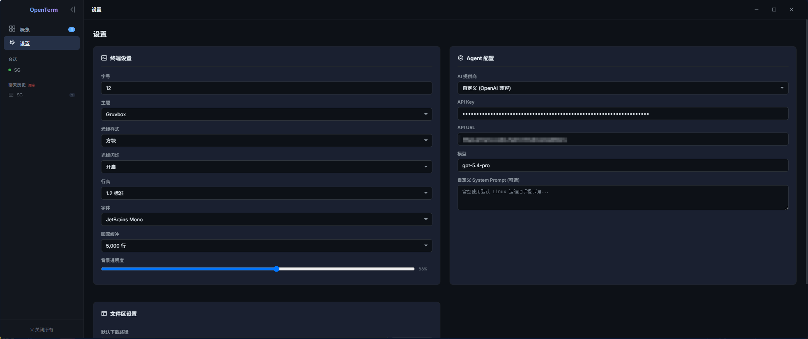

<div align="center">
  
  <h1>OpenTerm: Next-Gen AI SSH Terminal</h1>
  <p>不仅仅是一个 SSH 终端，更是你服务器里内置的极客智能运维助理。</p>
  
</div>

## 📖 项目简介

**OpenTerm** 是一款由 AI 深度驱动的全新下一代 SSH 服务器管理工具，基于 Electron + React 构建。它不仅仅是一个简单的交互终端，而是将 **大语言模型（LLM）** 无缝编织进了服务器的日常管理、运维排障以及代码开发中，真正做到了“基于自然语言的 Linux 服务器运维”。

通过原生集成的“极客 Agent”，OpenTerm 能够根据对话自动理解意图，生成可靠的 Bash 脚本并一键执行，极大降低了服务器管理门槛，同时为高级运维人员提供了极佳的自动化工作流增强。

---

## ⚡ 核心能力 (What Can It Do?)

OpenTerm 被设计用来颠覆传统的 SSH 交互体验：

*   🤖 **「原生化」AI 助手**: 拥有内置的 Agent 系统。Agent 表现出极其专业 Linux 行事风格。
*   🚀 **自动补全与执行 (Relaxed Mode)**: 在宽松模式下，Agent 可以根据你的口令自动接管终端环境，为你执行查询、日志截取与脚本部署。
*   📂 **可视化 SFTP 搭配 Drag-to-Chat**: 拥有直观的可视化文件管理器（File Manager）。你可以将服务器的文件、甚至是整个目录，**直接拖拽到 AI 聊天框里**，Agent 会自动扫描并读取上下文，帮你分析日志、优化核心代码，真正实现文件与 AI 的零距离互动。
*   📊 **智能结果面板 (Agent Result Panel)**: 执行枯燥命令（如 `df -h`, `docker ps` 等）时，右侧边栏会自动渲染美观的摘要卡片，为你将冰冷的服务器输出翻译成人类可读的深度体检报告或诊断建议。

<div align="center">
  
  
</div>

---

## 📸 运行截图与演示

**多会话与 Agent 聊天协同界面：**


**服务器性能与资源监控中心：**


**交互与文件处理系统：**


*(您可以直观看到原生极简化设计的暗黑主题、半透明悬浮窗以及极具未来感的体验)*

---

## 🛠 部署方案与运行指南

### 环境依赖
*   **Node.js**: `v18.0.0` 或更高版本
*   **Git** & **NPM/Yarn/PNPM**
*   (推荐) 任意兼容 OpenAI 接口格式的大模型 API Key 服务商（例如 Deepseek, GPT-4, Claude 等）

### 本地开发与运行 (Development)

1. **克隆项目到本地**
   ```bash
   git clone https://github.com/XingZiH/Openterm.git
   cd Openterm
   ```

2. **安装项目依赖**
   ```bash
   npm install
   # 或 yarn install
   ```

3. **启动开发热重载服务器**
   ```bash
   npm run dev
   ```
   > 运行后，系统将自动拉起带有完全调试环境的 OpenTerm 窗口，您可以在左下角配置您的 LLM API Key 以激活智能 Agent 功能。

### 构建分发版本 (Build & Deployment)

如果您想要将 OpenTerm 编译为您操作系统的独立可执行文件（`.exe`、`.dmg` 等）进行分发或无依赖安装：

1. **执行构建生产资源命令**
   ```bash
   npm run build
   ```

2. **触发 Electron-Builder 打包** (自动识别系统)
   ```bash
   # 对于 Windows 系统生成 exe
   npx electron-builder --win 
   
   # 对于 Mac OS 生成 dmg/app
   npx electron-builder --mac
   
   # 对于 Linux 系统生成 AppImage / deb
   npx electron-builder --linux
   ```
   *打包完成后，所有的安装程序及绿色版目录均会输出在代码根目录的 `dist/` 文件夹下。您可直接分发由构建生成的 Setup.exe 安裝包。*

---

## 💻 使用方法与工作流范例

1. **连接第一台服务器**
   * 进入主界面后，点击侧边栏 `+`，输入主机IP、用户与密码/私钥。
   * 数据完全由 `electron-store` 保存在本地系统漫游区，永远**不会同步至云端**，安全隐私。
2. **唤醒 AI 智能体**
   * 点击右上角魔法棒/对话框图标。
   * 输入您的个人第三方 `API Key`（如腾讯元宝、Moonshot、OpenAI等均可接入中转）。
   * 勾选「宽松模式」(Relaxed Mode) 即可开启自动代执行。
3. **沉浸式自动化范例**
   * 💡 **场景1**：在对话框输入 _“帮我查一下这台机器为什么好卡”_ -> Agent 将向隐藏通道注入 `top` 等分析指令 -> 侧边栏卡片自动输出 CPU 被 XXX 进程抢占的智能诊断结果。
   * 💡 **场景2**：在可视化文件管理器中找到 Nginx 报错日志 `/var/log/nginx/error.log` -> 将文件推拽入 AI 发送框 -> 敲击命令 _“找出昨晚数据库断开的根因出在哪里并修补”_ -> Agent 自动执行！

---

> _**OpenTerm** - Reimagining the CLI. Building an aesthetic, robust & highly competent infrastructure operations hub for the modern developer._
